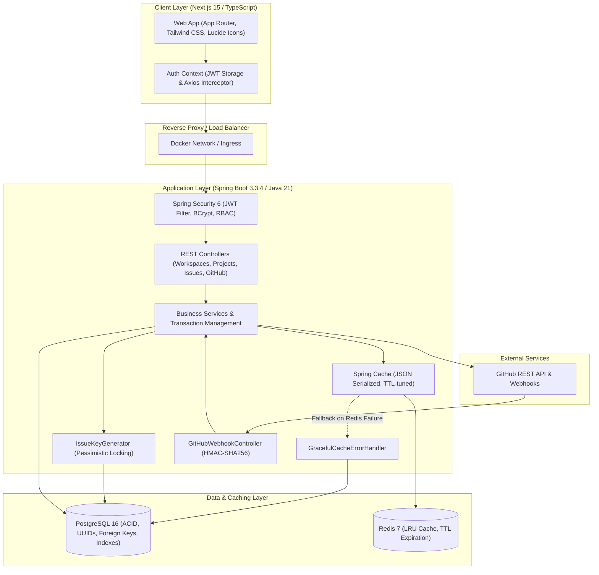

# DevFlow

> **A high-performance, lightweight engineering workspace and issue tracking platform for software development teams.**

[](https://github.com/sanjaykamal2006/devflow/actions)
[](https://openjdk.org/projects/jdk/21/)
[](https://spring.io/projects/spring-boot)
[](https://nextjs.org/)
[](https://www.typescriptlang.org/)
[](https://www.postgresql.org/)
[](https://redis.io/)
[](https://tailwindcss.com/)
[](https://www.docker.com/)
[](LICENSE)

---

## Table of Contents

1. [Overview & Philosophy](#overview--philosophy)
2. [Key Features & Capabilities](#key-features--capabilities)
3. [System Architecture](#system-architecture)
4. [Deep-Dive Engineering Highlights](#deep-dive-engineering-highlights)
   - [1. Concurrency-Safe Linear Issue Keys](#1-concurrency-safe-linear-issue-keys)
   - [2. Multi-Tenant Workspace Isolation & Anti-IDOR RBAC](#2-multi-tenant-workspace-isolation--anti-idor-rbac)
   - [3. Resilient Redis Caching with Graceful Degradation](#3-resilient-redis-caching-with-graceful-degradation)
   - [4. GitHub Integration with HMAC-SHA256 Webhooks](#4-github-integration-with-hmac-sha256-webhooks)
   - [5. Native Database Count Query Optimization](#5-native-database-count-query-optimization)
5. [Database Schema & Data Model](#database-schema--data-model)
6. [Core Technical Stack](#core-technical-stack)
7. [Getting Started & Local Setup](#getting-started--local-setup)
   - [Option A: Running with Docker Compose (Recommended)](#option-a-running-with-docker-compose-recommended)
   - [Option B: Running from Source](#option-b-running-from-source)
8. [Automated Testing & Verification (25/25 Passing)](#automated-testing--verification-2525-passing)
9. [REST API Documentation](#rest-api-documentation)
10. [Architectural Tradeoffs & Interview Highlights](#architectural-tradeoffs--interview-highlights)
11. [License](#license)

---

## Overview & Philosophy

Modern engineering teams often face an unpleasant dichotomy: enterprise trackers like Jira are bloated, slow, and overburdened with configuration bureaucracy, while basic tools like GitHub Issues lack cross-repository workspace isolation, custom project workflows, and unified team management.

**DevFlow** bridges this gap by delivering the speed and simplicity of Linear combined with robust multi-tenant enterprise engineering:
- **Clean Workspace & Project Hierarchies**: Multi-tenant workspace isolation with role-based access control (`OWNER`, `ADMIN`, `MEMBER`).
- **Jira-Style Linear Issue Keys**: Human-friendly keys like `ENG-101` and `PLAT-42` backed by pessimistic row locking to prevent collisions during parallel creation.
- **Interactive Dual Views**: High-density Kanban board with rapid column navigation actions alongside a filterable, paginated Issue Table.
- **Bi-Directional GitHub Sync**: Connect GitHub repositories, inspect commits and pull requests, and automatically transition issues when PRs merge or commit messages contain references like `fixes ENG-101`.
- **Zero-Friction Developer UX**: Instant search, dark-mode native design, and low latency caching.

---

## Key Features & Capabilities

| Feature Area | What DevFlow Delivers |
|---|---|
| **Multi-Tenancy** | Workspaces isolate users, projects, issues, comments, labels, and activity logs. Users can belong to multiple workspaces with distinct roles. |
| **RBAC Security** | Fine-grained roles (`OWNER`, `ADMIN`, `MEMBER`). Destructive operations like deleting projects or issues are strictly restricted to `ADMIN` and `OWNER`. |
| **Linear Issue Keys** | Human-readable keys (`DEV-1`, `DEV-2`) generated sequentially per project using database-level pessimistic locking. |
| **Dual Issue Views** | **Kanban Board** with quick column transitions (`BACKLOG` $\rightarrow$ `TODO` $\rightarrow$ `IN_PROGRESS` $\rightarrow$ `IN_REVIEW` $\rightarrow$ `DONE`) and **Issue Table** with multi-field filtering and pagination. |
| **Issue Details & Collaboration**| Threaded Markdown comments, custom color-coded labels, priority indicators (`LOW`, `MEDIUM`, `HIGH`, `URGENT`), and issue types (`BUG`, `FEATURE`, `TASK`, `IMPROVEMENT`). |
| **GitHub Automation** | Ingests GitHub webhooks with HMAC-SHA256 verification. Commits with `fixes KEY-X`, `closes KEY-X`, or `resolves KEY-X` automatically move issues to `DONE`. |
| **Resilient Infrastructure** | Redis caching with graceful degradation to PostgreSQL; Docker Compose setup with health checks; GitHub Actions CI pipeline. |

---

## System Architecture



---

## Deep-Dive Engineering Highlights

### 1. Concurrency-Safe Linear Issue Keys

#### The Problem
In engineering issue trackers, issues must have project-prefixed sequential keys (e.g., `DEV-1`, `DEV-2`). Naive implementations calculate the next number via:
```sql
SELECT MAX(issue_number) FROM issues WHERE project_id = :projectId;
```
Under concurrent creation requests (e.g., automated test suites, CI bots, multiple engineers creating tasks simultaneously), this leads to **race conditions**, resulting in duplicate key collisions or database unique constraint crashes.

#### DevFlow Solution
DevFlow implements an isolated sequence entity `ProjectIssueSequence` managed by `IssueKeyGenerator`:

```java
@Entity
@Table(name = "project_issue_sequences")
public class ProjectIssueSequence {
    @Id
    @Column(name = "project_id")
    private UUID projectId;

    @Column(name = "last_number", nullable = false)
    private Long lastNumber;
    // ...
}
```

The key generation query uses JPA's `PESSIMISTIC_WRITE` lock:
```java
@Lock(LockModeType.PESSIMISTIC_WRITE)
@Query("SELECT s FROM ProjectIssueSequence s WHERE s.projectId = :projectId")
Optional<ProjectIssueSequence> findByProjectIdForUpdate(@Param("projectId") UUID projectId);
```

When an issue is created, `IssueKeyGenerator` executes within a dedicated `REQUIRES_NEW` transaction:
1. Obtains an exclusive row lock (`SELECT ... FOR UPDATE`) on the project's sequence row.
2. Increments `last_number` monotonically.
3. Formats the string `KEY-{number}` (e.g. `DEV-14`).
4. Commits the sequence transaction, releasing the lock in milliseconds before the parent entity is processed.

**Verification Under Real Concurrency**: Verified by `IssueKeyGeneratorConcurrencyIntegrationTest`. 10 concurrent threads simultaneously requesting issue keys against a relational database with `CountDownLatch` synchronization generate monotonically incrementing keys (`CONCUR-1` through `CONCUR-10`) with zero duplicate-key collisions or database constraint violations.

---

### 2. Multi-Tenant Workspace Isolation & Anti-IDOR RBAC

#### The Problem
A common vulnerability in multi-tenant SaaS architectures is **Insecure Direct Object Reference (IDOR)**: where endpoint handlers take an ID parameter (e.g. `GET /api/issues/{id}` or `GET /api/projects/{id}`) and fetch the entity from the database or a shared cache without verifying that the requesting user belongs to the workspace owning that entity.

#### DevFlow Solution
DevFlow enforces a strict hierarchical security boundary via `WorkspaceSecurityService`:
1. **Explicit Ownership Checks**: Every resource hierarchy (`Workspace -> Project -> Issue -> Comment`) is resolved back to its containing `workspaceId`.
2. **Spring Security Integration**: Controllers use `@PreAuthorize("@workspaceSecurity.canAccessProject(#projectId, principal)")` and `@PreAuthorize("@workspaceSecurity.hasRoleInWorkspace(#workspaceId, 'ADMIN', principal)")`.
3. **Defense in Depth**: If a user attempts to request an issue or project outside their workspace, `WorkspaceSecurityService` rejects the operation with an `AccessDeniedException`, which maps to `403 Forbidden` with a structured `ErrorResponse`.
4. **Security-First Caching (Zero IDOR Risk)**: Individual entity lookups (e.g. `ProjectService.getProject`) deliberately avoid naive `@Cacheable` annotations that could serve cached objects across tenant boundaries. Authorization and workspace membership validation are executed on every single query against the database.
5. **Strict RBAC for Deletions**: Destructive operations are strictly bounded. Deleting an issue is restricted to workspace `ADMIN` or `OWNER` roles (`MEMBER` requests are rejected with `403 Forbidden`).
6. **Deliberate Service-Layer Cascading Cleanup**: Deleting workspaces or projects triggers explicit hierarchical cleanup of child comments, activities, issues, sequences, labels, and GitHub repository configurations, preventing foreign key integrity crashes.

```
User Request ──► JwtAuthenticationFilter (extracts user ID)
                      │
                      ▼
               @PreAuthorize Check:
               WorkspaceSecurityService.canAccessIssue(issueId, principal)
                      │
                      ├─► Resolves Issue ──► Project ──► Workspace
                      │
                      ├─► Validates User is active member of Workspace?
                      │     ├── YES ──► Allow execution
                      │     └── NO  ──► 403 Forbidden (Anti-IDOR protection)
```

---

### 3. Resilient Redis Caching with Graceful Degradation

#### The Problem
Standard Spring Cache (`@Cacheable`) implementations typically throw an uncaught exception (`RedisConnectionException`) if the Redis instance crashes, undergoes a maintenance failover, or encounters network partitions. This causes critical user-facing endpoints to return `500 Internal Server Error` even when PostgreSQL is completely healthy.

#### DevFlow Solution
DevFlow implements a custom `GracefulCacheErrorHandler` registered in `RedisConfig`:

```java
@Configuration
@EnableCaching
public class RedisConfig extends CachingConfigurerSupport {

    @Override
    public CacheErrorHandler errorHandler() {
        return new GracefulCacheErrorHandler();
    }
}
```

When Redis operations fail, `GracefulCacheErrorHandler`:
1. Intercepts the failure (`handleCacheGetError`, `handleCachePutError`, `handleCacheEvictError`).
2. Logs a structured warning with the cache name and key:
   ```
   WARN [GracefulCacheErrorHandler] Redis cache GET error for key 'projects:ws-uuid': connection refused. Falling back to DB.
   ```
3. Swallows the exception and returns `null` on cache reads.

**Result**: Spring Data JPA transparently executes the underlying SQL query directly against PostgreSQL. The API experiences zero downtime or 500 errors during Redis disruptions.

---

### 4. GitHub Integration with HMAC-SHA256 Webhooks

#### The Problem
Webhook endpoints that receive external push notifications must verify authenticity to prevent malicious actors from forging commit updates or PR merge events.

#### DevFlow Solution
DevFlow provides a production-grade webhook receiver in `GitHubWebhookController`:
1. **Cryptographic Verification**: Computes the HMAC-SHA256 digest of the raw request payload using the configured webhook secret and compares it against the `X-Hub-Signature-256` header using `MessageDigest.isEqual` to prevent timing attacks.
2. **Issue Key Pattern Extractor**: Uses regex `(?i)(?:^|[\s\[\(\{#])([A-Z0-9]{2,10}-\d+)` to identify references in commit messages, branch names, and PR titles.
3. **Closing Keyword Automation**: Recognizes keywords like `fixes KEY-X`, `closes KEY-X`, and `resolves KEY-X` (via `GitHubIssueKeyExtractor.extractClosingKeys`).
4. **Automated Issue Workflow**: When closing commits are pushed or pull requests referencing issues are merged into the repository's default branch, DevFlow automatically transitions the referenced issues to `IssueStatus.DONE` and records an immutable audit trail in `github_activities`.

---

### 5. Native Database Count Query Optimization

#### The Problem
Counting members or projects in workspaces by fetching complete entity collections into Java heap memory and calling `.size()` degrades application throughput and triggers excessive memory consumption as teams scale.

#### DevFlow Solution
DevFlow implements native database count queries in `WorkspaceMemberRepository` and `ProjectRepository`:
```java
long countByWorkspaceId(UUID workspaceId);
```
In `WorkspaceService`, member and project counts are fetched via SQL `COUNT(*)` operations, eliminating entity hydration overhead and reducing memory pressure to $O(1)$.

---

## Database Schema & Data Model

```
 ┌──────────────┐       ┌──────────────────────┐       ┌────────────────────────┐
 │    users     │       │      workspaces      │       │   workspace_members    │
 ├──────────────┤       ├──────────────────────┤       ├────────────────────────┤
 │ id (UUID)    │◄──────┼── owner_id (UUID)    │◄──────┼── workspace_id (UUID)  │
 │ email        │       │   name               │       │   user_id (UUID)       │
 │ password     │       │   slug (unique)      │       │   role (OWNER/ADMIN...)│
 └──────┬───────┘       └──────────┬───────────┘       └────────────────────────┘
        │                          │
        │                          ▼
        │               ┌──────────────────────┐       ┌────────────────────────┐
        │               │       projects       │       │ project_issue_sequences│
        │               ├──────────────────────┤       ├────────────────────────┤
        │               │ id (UUID)            │◄──────┼── project_id (UUID PK) │
        │               │ workspace_id (UUID)  │       │   last_number (BIGINT) │
        │               │ project_key (VARCHAR)│       └────────────────────────┘
        │               │ name                 │
        │               └──────────┬───────────┘
        │                          │
        │                          ▼
        │               ┌──────────────────────┐       ┌────────────────────────┐
        │               │        issues        │◄──────┤     issue_labels       │
        │               ├──────────────────────┤       ├────────────────────────┤
        ├──────────────►│ id (UUID)            │       │ issue_id (UUID)        │
        │ (reporter/    │ project_id (UUID)    │       │ label_id (UUID)        │
        │  assignee)    │ issue_key (unique)   │       └────────────────────────┘
        │               │ status (BACKLOG...)  │
        │               │ priority (HIGH...)   │       ┌────────────────────────┐
        │               │ issue_type (BUG...)  │       │     issue_comments     │
        │               └──────────┬───────────┘       ├────────────────────────┤
        │                          │                   │ id (UUID)              │
        │                          ├──────────────────►│ issue_id (UUID)        │
        │                          │                   │ author_id (UUID)       │
        │                          ▼                   └────────────────────────┘
        │               ┌──────────────────────┐
        │               │  github_activities   │       ┌────────────────────────┐
        │               ├──────────────────────┤       │  github_repositories   │
        │               │ id (UUID)            │       ├────────────────────────┤
        └──────────────►│ issue_id (UUID)      │       │ id (UUID)              │
                        │ activity_type        │◄──────┼── project_id (UUID)    │
                        │ commit_hash / pr_num │       │   repo_url, repo_name  │
                        └──────────────────────┘       └────────────────────────┘
```

---

## Core Technical Stack

### Backend
- **Java 21**: Pattern matching, record types, immutable data structures.
- **Spring Boot 3.3.4**: Embedded Tomcat, Actuator health endpoints, modular configuration.
- **Spring Security 6 & JJWT (0.12.6)**: Stateless JWT token provider, Bearer authentication filter, method-level `@PreAuthorize`.
- **Spring Data JPA & Hibernate 6**: Pessimistic locking, specifications, indexes, foreign key relationships.
- **PostgreSQL 16**: Relational storage, UUIDs, sequences, foreign key constraints.
- **Redis 7 & Spring Data Redis**: Cache layer with polymorphic Jackson serialization and custom TTL configuration.
- **Maven**: Reproducible compilation and dependency management.

### Frontend
- **Next.js 15.1.0 (App Router)**: Fast Server Components and responsive Client Components with React 19.
- **TypeScript**: End-to-end type safety for API requests, responses, and state models.
- **Tailwind CSS**: Dense, clean, developer-focused utility styling tailored for dark environments.
- **Lucide React**: Crisp, modern icon set.
- **Axios**: HTTP client with request/response interceptors for JWT token injection and error normalization.

### Infrastructure & CI
- **Docker & Multi-Stage Dockerfiles**: Optimized Temurin 21 JRE container (~200MB) and standalone Node.js runner (~120MB).
- **Docker Compose**: Orchestrates PostgreSQL, Redis, Backend, and Frontend with healthcheck dependency gates.
- **GitHub Actions**: Automated CI matrix executing backend integration tests against live PostgreSQL & Redis service containers and frontend linting/compilation.

---

## Getting Started & Local Setup

### Option A: Running with Docker Compose (Recommended)

1. **Clone the repository**:
   ```bash
   git clone https://github.com/sanjaykamal2006/devflow.git
   cd devflow
   ```

2. **Configure environment variables**:
   ```bash
   cp .env.example .env
   ```

3. **Start all services**:
   ```bash
   docker compose up --build
   ```

4. **Access the application**:
   - **Frontend UI**: [http://localhost:3000](http://localhost:3000)
   - **Backend API**: [http://localhost:8080/api](http://localhost:8080/api)
   - **PostgreSQL**: `localhost:5432` (`devflow` / `devflow_secure_password_replace_in_prod`)
   - **Redis**: `localhost:6379`

---

### Option B: Running from Source

#### Prerequisites
- Java 21 (Temurin / OpenJDK)
- Maven 3.9+
- Node.js 20+ and npm
- Docker (for PostgreSQL and Redis containers)

#### 1. Start Infrastructure Dependencies
```bash
docker run -d --name devflow-postgres -p 5432:5432 -e POSTGRES_DB=devflow -e POSTGRES_USER=devflow -e POSTGRES_PASSWORD=devflow_secure_password_replace_in_prod postgres:16-alpine
docker run -d --name devflow-redis -p 6379:6379 redis:7-alpine
```

#### 2. Start the Spring Boot Backend
```bash
cd backend
mvn clean spring-boot:run
```
The backend initializes the schema, establishes Redis connectivity, and listens on port `8080`.

#### 3. Start the Next.js Frontend
```bash
cd frontend
npm install
npm run dev
```
Open [http://localhost:3000](http://localhost:3000) in your browser.

---

## Automated Testing & Verification (25/25 Passing)

DevFlow maintains a rigorous automated testing suite covering unit logic, pessimistic locking, API security filters, IDOR prevention, cascading deletions, and multi-threaded concurrency:

```bash
cd backend
mvn test
```

### Verified Test Suite Breakdown (25/25 Passing — 100%)

| Test Class | Category | What It Verifies | Tests |
|---|---|---|:---:|
| `IssueKeyGeneratorConcurrencyIntegrationTest` | Concurrency | 10 parallel threads with `CountDownLatch` generate monotonic keys (`CONCUR-1` to `CONCUR-10`) with zero duplicate-key collisions | 1 |
| `DeletionAndRbacIntegrationTest` | Security & DB | Rejects `MEMBER` issue deletion (`403 Forbidden`); confirms `ADMIN`/`OWNER` deletion; verifies cascading cleanup for workspaces, projects, issues, comments, activities | 4 |
| `GitHubWebhookAutomationIntegrationTest` | Integration | Commits with `fixes`, `closes`, `resolves` and merged PRs advance issues to `IssueStatus.DONE` and record audit entries | 1 |
| `AuthControllerIntegrationTest` | API Integration | End-to-end user registration, login, password encryption with BCrypt, and JWT token issuance | 4 |
| `IssueApiIntegrationTest` | API Integration | Full lifecycle test creating workspace, project, issue; asserts IDOR rejection when accessed with non-member credentials | 1 |
| `AuthServiceTest` | Unit | Registration validation, BCrypt password hashing, JWT generation, duplicate email rejection | 4 |
| `GitHubIssueKeyExtractorTest` | Unit | Regex extraction of keys (`DEV-123`, `[PLAT-42]`, `#CORE-9`) and closing syntax across edge-case strings | 5 |
| `IssueKeyGeneratorTest` | Unit | Atomic incrementation and pessimistic write locking under race-condition simulations | 2 |
| `IssueServiceTest` | Unit | Status transitions, label associations, and assignee assignments | 2 |
| `WorkspaceSecurityServiceTest` | Unit | RBAC boundaries (`OWNER`, `ADMIN`, `MEMBER`) and cross-workspace access denials | 4 |

### Frontend Quality Verification
```bash
cd frontend
npm run lint
npm run build
```
Enforces zero ESLint warnings, TypeScript strict mode compliance, and Next.js 15 App Router production optimization across all 9 static and dynamic routes.

---

## REST API Documentation

All endpoints return JSON responses. Protected endpoints require the header `Authorization: Bearer <token>`.

### Authentication (`/api/auth`, `/api/users`)
| Method | Endpoint | Description | Auth Required |
|---|---|---|---|
| `POST` | `/api/auth/register` | Register a new user | No |
| `POST` | `/api/auth/login` | Authenticate and obtain JWT token | No |
| `GET` | `/api/users/me` | Fetch currently authenticated user profile | Yes |

### Workspaces (`/api/workspaces`)
| Method | Endpoint | Description | Auth Required |
|---|---|---|---|
| `GET` | `/api/workspaces` | List all workspaces where user is a member | Yes |
| `POST` | `/api/workspaces` | Create a new workspace (creator becomes OWNER) | Yes |
| `GET` | `/api/workspaces/{id}` | Get workspace details | Yes (Member) |
| `PATCH` | `/api/workspaces/{id}` | Update workspace name/slug | Yes (ADMIN/OWNER) |
| `DELETE` | `/api/workspaces/{id}` | Delete workspace and all associated projects & issues | Yes (OWNER) |
| `GET` | `/api/workspaces/{id}/members` | List members of a workspace | Yes (Member) |
| `POST` | `/api/workspaces/{id}/members` | Add a member by email | Yes (ADMIN/OWNER) |
| `PATCH` | `/api/workspaces/{id}/members/{userId}` | Update member role | Yes (ADMIN/OWNER) |
| `DELETE` | `/api/workspaces/{id}/members/{userId}` | Remove a member from workspace | Yes (ADMIN/OWNER) |

### Projects (`/api`)
| Method | Endpoint | Description | Auth Required |
|---|---|---|---|
| `GET` | `/api/workspaces/{workspaceId}/projects` | List all projects in a workspace | Yes (Member) |
| `POST` | `/api/workspaces/{workspaceId}/projects` | Create a project with unique key prefix | Yes (ADMIN/OWNER) |
| `GET` | `/api/projects/{id}` | Get project overview & statistics | Yes (Member) |
| `PATCH` | `/api/projects/{id}` | Update project name or description | Yes (ADMIN/OWNER) |
| `DELETE` | `/api/projects/{id}` | Delete a project and cascade delete issues | Yes (ADMIN/OWNER) |

### Issues (`/api`)
| Method | Endpoint | Description | Auth Required |
|---|---|---|---|
| `GET` | `/api/projects/{projectId}/issues` | Paginated list of issues with filter parameters | Yes (Member) |
| `POST` | `/api/projects/{projectId}/issues` | Create an issue (generates concurrency-safe key) | Yes (Member) |
| `GET` | `/api/issues/{id}` | Get full issue details by UUID | Yes (Member) |
| `GET` | `/api/issues/key/{key}` | Get full issue details by human key (e.g. `DEV-1`) | Yes (Member) |
| `PATCH` | `/api/issues/{id}` | Update title, description, priority, type | Yes (Member) |
| `PATCH` | `/api/issues/{id}/status` | Update workflow status (Backlog -> In Progress -> Done) | Yes (Member) |
| `PATCH` | `/api/issues/{id}/assign` | Assign or unassign issue to a workspace member | Yes (Member) |
| `DELETE` | `/api/issues/{id}` | Delete an issue | Yes (ADMIN/OWNER) |
| `POST` | `/api/issues/{id}/labels/{labelId}` | Attach label to issue | Yes (Member) |
| `DELETE` | `/api/issues/{id}/labels/{labelId}` | Remove label from issue | Yes (Member) |

### Comments (`/api`)
| Method | Endpoint | Description | Auth Required |
|---|---|---|---|
| `GET` | `/api/issues/{issueId}/comments` | List discussion comments on an issue | Yes (Member) |
| `POST` | `/api/issues/{issueId}/comments` | Add a comment to an issue | Yes (Member) |
| `PATCH` | `/api/comments/{id}` | Update an existing comment | Yes (Author) |
| `DELETE` | `/api/comments/{id}` | Delete a comment | Yes (Author/ADMIN) |

### Labels (`/api/projects/{projectId}/labels`)
| Method | Endpoint | Description | Auth Required |
|---|---|---|---|
| `GET` | `/api/projects/{projectId}/labels` | List labels for a project | Yes (Member) |
| `POST` | `/api/projects/{projectId}/labels` | Create a custom color-coded label | Yes (Member) |
| `DELETE` | `/api/projects/{projectId}/labels/{labelId}` | Delete a label | Yes (Member) |

### GitHub Integration (`/api`, `/api/webhooks/github`)
| Method | Endpoint | Description | Auth Required |
|---|---|---|---|
| `POST` | `/api/projects/{projectId}/github` | Connect a GitHub repository to a project | Yes (ADMIN/OWNER) |
| `GET` | `/api/projects/{projectId}/github` | Get repository configuration | Yes (Member) |
| `DELETE` | `/api/projects/{projectId}/github` | Disconnect GitHub repository | Yes (ADMIN/OWNER) |
| `POST` | `/api/projects/{projectId}/github/sync` | Manually sync recent repository commits | Yes (Member) |
| `GET` | `/api/issues/{issueId}/github-activity` | Get commit/PR activity linked to an issue | Yes (Member) |
| `POST` | `/api/webhooks/github` | Webhook receiver with HMAC-SHA256 signature validation | No (Signed payload) |

---

## Architectural Tradeoffs & Interview Highlights

### 1. Pessimistic Locking vs. Distributed Sequence Generators (Snowflake / Redis INCR)
- **Tradeoff**: Pessimistic row locking on PostgreSQL guarantees sequential gapless keys (`DEV-1, DEV-2, ...`) aligned with team expectations, at the cost of serializing issue creations for the *same* project to a few milliseconds.
- **Scaling Path**: If project write throughput exceeds hundreds of writes per second, sequence allocation can be batched (e.g. allocating chunks of 50 numbers in Redis or a Hi/Lo sequence generator).

### 2. Stateless JWT vs. Server-Side Sessions
- **Tradeoff**: Stateless JWT eliminates database read lookups on every request, making horizontal scaling behind a reverse proxy trivial.
- **Scaling Path**: To enable immediate token revocation upon password change or account deactivation, an explicit Redis token denylist can be checked during filter execution.

### 3. Anti-IDOR Security vs. Aggressive Caching
- **Tradeoff**: Caching entity lookups (e.g. `getProject`) with `@Cacheable` risks serving data across workspace boundaries if cache keys aren't strictly tenant-scoped. DevFlow prioritizes security by validating permissions on every database lookup, caching only safe project lists.

### 4. Real-time Live Collaboration
- **Current Architecture**: Optimistic React state updates with low-latency REST synchronization.
- **Next Step**: Implement Spring WebSocket STOMP messaging with Redis Pub/Sub to broadcast Kanban card status updates in real time across multiple connected clients.

---

## License

This project is licensed under the MIT License — see the [LICENSE](LICENSE) file for details.
